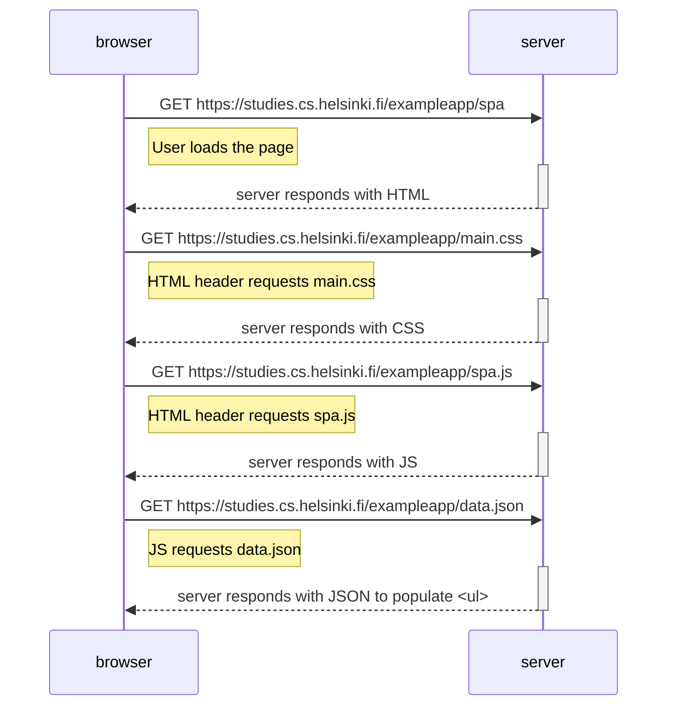

```mermaid
sequenceDiagram
participant browser
participant server


    browser->>server: GET https://studies.cs.helsinki.fi/exampleapp/spa
    Note right of browser: User loads the page

    activate server
    server-->>browser: server responds with HTML
    deactivate server

    browser->>server: GET https://studies.cs.helsinki.fi/exampleapp/main.css
    Note right of browser: HTML header requests main.css

    activate server
    server-->>browser: server responds with CSS
    deactivate server

    browser->>server: GET https://studies.cs.helsinki.fi/exampleapp/spa.js
    Note right of browser: HTML header requests spa.js

    activate server
    server-->>browser: server responds with JS
    deactivate server

    browser->>server: GET https://studies.cs.helsinki.fi/exampleapp/data.json
    Note right of browser: JS requests data.json

    activate server
    server-->>browser: server responds with JSON to populate <ul>
    deactivate server

```
