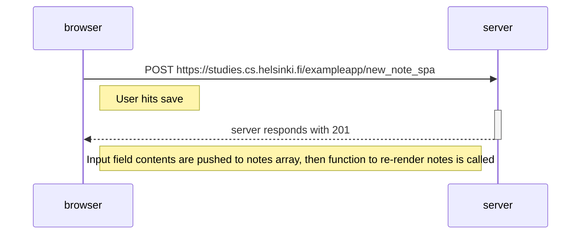

```mermaid
sequenceDiagram
participant browser
participant server


    browser->>server: POST https://studies.cs.helsinki.fi/exampleapp/new_note_spa
    Note right of browser: User hits save

    activate server
    server-->>browser: server responds with 201
    deactivate server
    Note left of server: Input field contents are pushed to notes array, then function to re-render notes is called


```
